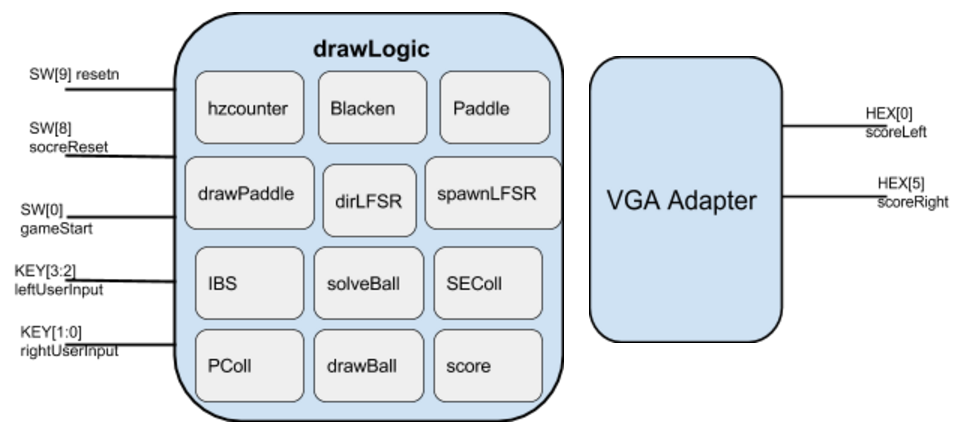
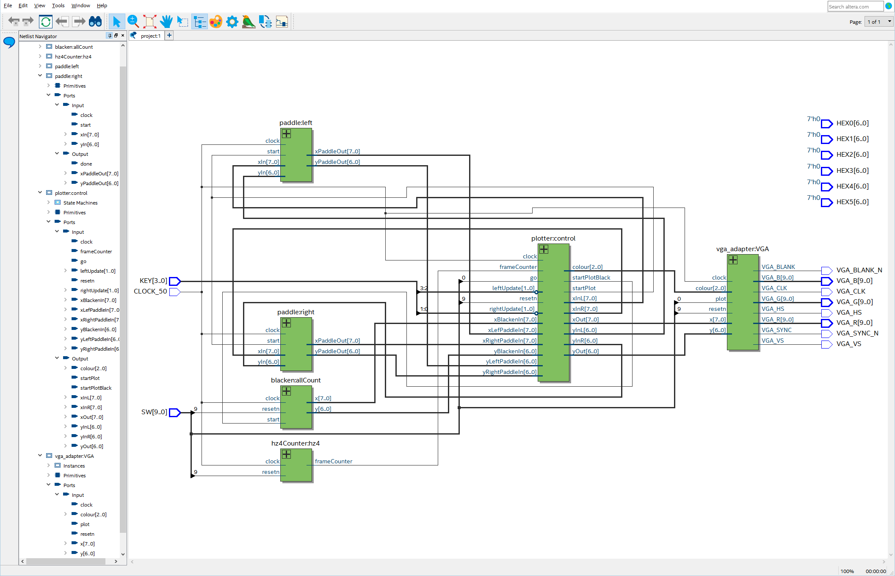
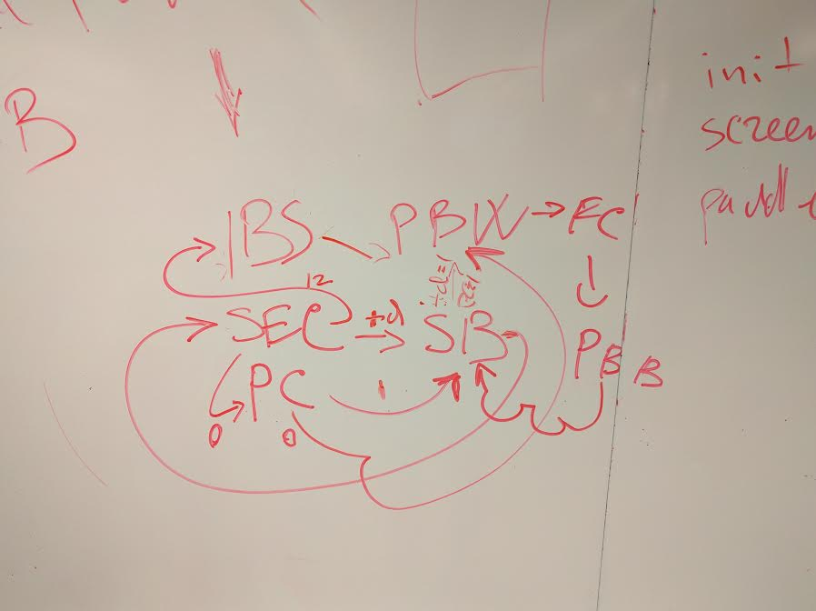

# '72Pong: A Transistor-Level Recreation of Atari's Classic

This project is a faithful, digital logic-level recreation of Atari's Pong (1972), the first commercially successful video game, implemented on a DE1-SoC FPGA board. This is a clean-room design, developed solely based on observations of the original game's behavior and publicly available information, without access to Atari's original schematics, all the functionality and score tracking of the original product present.

## Project Overview

Pong-FPGA is not just another software emulation of Pong. It's a ground-up hardware implementation that meticulously replicates the game's logic at the transistor level, mimicking the original hardware design principles used by Atari engineers in the early 1970s.

**Key Features:**

*   **Authentic Gameplay:**  Precisely reproduces the gameplay mechanics of the original Pong, including paddle movement, ball physics, and collision detection.
*   **Accurate Score Tracking:**  Keeps score just like the 1972 arcade cabinet, adding to the nostalgic experience.
*   **Clean-Room Design:**  Developed without reverse-engineering or referencing Atari's proprietary schematics. This demonstrates a deep understanding of digital logic design and the ability to recreate complex systems from functional specifications.
*   **Transistor-Level Implementation:**  The design is implemented at the transistor level, showcasing proficiency in low-level hardware design and a commitment to authenticity.
*   **FPGA Implementation:**  Built and tested on a DE1-SoC FPGA board, leveraging the flexibility and power of programmable logic.

## Why This Project is Unique

This project stands out from typical Pong implementations in several ways:

1.  **Historical Accuracy:**  It aims to be a historically accurate representation of the original Pong hardware, offering a glimpse into the early days of video game engineering.
2.  **Educational Value:** It serves as an excellent educational resource for anyone interested in digital logic design, FPGA development, and the history of video games.
3.  **Technical Challenge:** Implementing a complex system like Pong at the transistor level on an FPGA is a significant technical undertaking, demonstrating strong hardware design skills.
4.  **Clean Room Design Prowess:** It is impressive to successfully recreate a system's functionality without having access to its original design.

## Block Diagram

The image below shows the block diagram of the architecture of this project.


## RTL Diagram

The image below shows the RTL diagram of the architecture of this project.


## Getting Started

### Prerequisites

*   Intel Quartus Prime (version compatible with DE1-SoC)
*   DE1-SoC FPGA board
*   VGA monitor

### Installation

1.  Clone this repository:
    ```bash
    git clone <your repository link>
    ```
2.  Open the project in Quartus Prime.
3.  Compile the project.
4.  Program the DE1-SoC board with the generated `.sof` file.

### Usage

*   **SW\[9]:** Global Reset
*   **SW\[8]:** Score Reset
*   **SW\[0]:** Start Game
*   **KEY\[3:2]:** Left Paddle Control
*   **KEY\[1:0]:** Right Paddle Control
*   **HEX\[0]:** Left Player Score
*   **HEX\[5]:** Right Player Score

## Further Development

Possible future enhancements include:

*   Adding sound effects.
*   Implementing different game modes (e.g., single-player against AI).
*   Improving the visual aesthetics of the display.

## FSM Diagram

The image below shows the FSM diagram of the architecture of this project.


## Acknowledgments

*   Atari, for creating the original Pong game.
*   The creators and maintainers of the various online resources that provided information about the original Pong's functionality.
